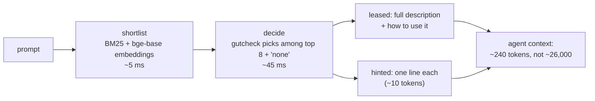
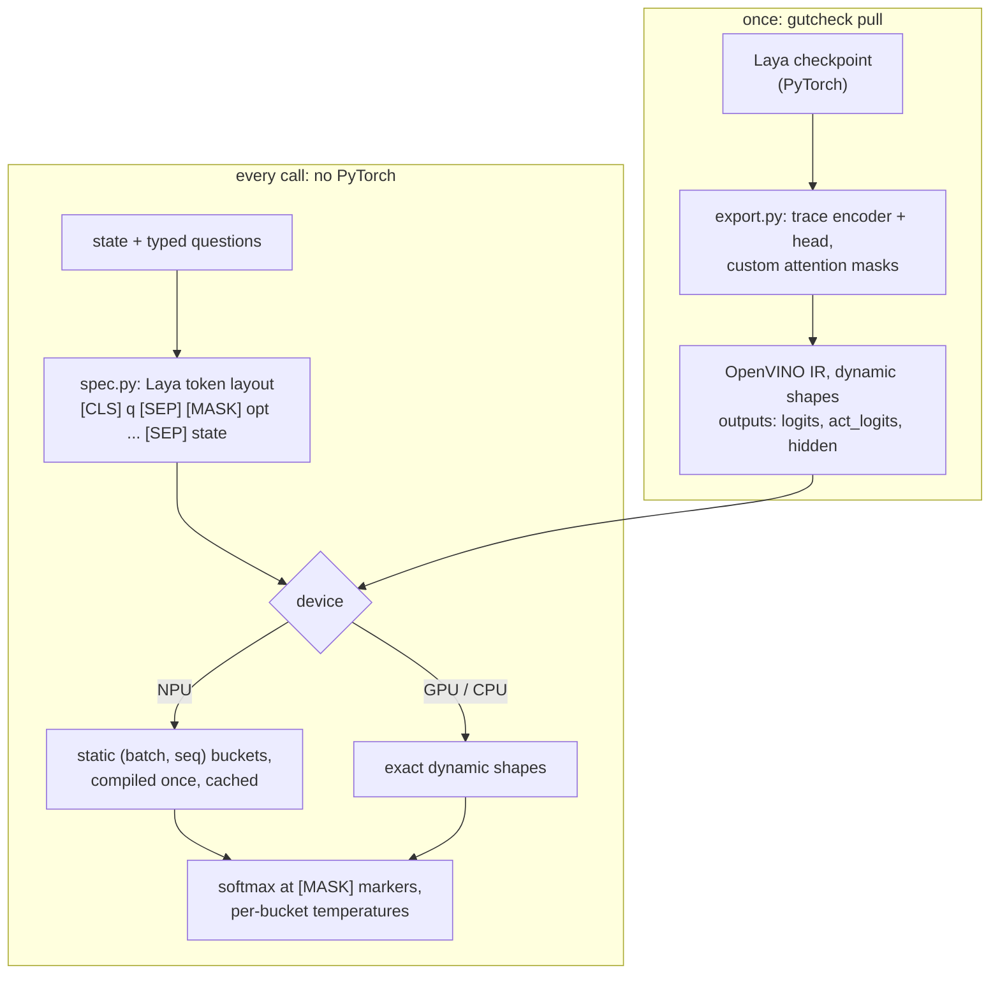

<div align="center">

# gutcheck

**Fast, calibrated System-1 decisions on the NPU or GPU you already own,
and a lease layer that stops your AI agent from loading every skill and tool on every turn.**

[](https://github.com/janmejai2002/gutcheck/actions/workflows/ci.yml)


[Why](#why) · [Install](#install) · [Quickstart](#quickstart) · [Results](#results) · [Fine-tuning](#fine-tune-in-25-minutes-on-a-laptop) · [Leasing](#leasing-skills-and-mcp-tools-on-demand) · [How it works](#how-it-works) · [Limitations](#honest-limitations) · [Roadmap](#roadmap)

</div>

```text
$ gutcheck ask "Our SSO has been down since the update. Fix it today or we move to Asana." \
    --choice "technical_help=bug or outage,billing_question,refund,cancellation" \
    --noul "The customer threatens to leave"

  choice             choice -> technical_help  (p 0.81)
      technical_help           0.815 ###########...
      cancellation             0.123 ##............
      billing_question         0.036 ..............
      refund                   0.027 ..............
  noul               noul  P(true) = 0.264  #####...............
  [laya-en on GPU, 19 ms]
```

19 ms, on a laptop iGPU, no API key, no tokens. (And yes: 0.26 is wrong, "or we move to Asana" *is* a churn
threat. Zero-shot is decent, not magic. [Fine-tuning](#fine-tune-in-25-minutes-on-a-laptop) exists for exactly this.)

---

## Why

Most agent stacks use a frontier LLM for everything, including decisions a reflex could make: *is this a refund
request? which team? is this prompt an injection? does this request need the GitHub tools?* That is a senior lawyer
sorting the mail: slow, expensive, and the answer comes back as prose you then have to parse.

In September 2026 TypeSafe shipped **Jev**, a hosted "System One" model built for exactly this: it answers typed
questions (`choice`, `score`, yes/no `noul`) about any text or JSON with calibrated probabilities. ConvAI released
**[Laya](https://huggingface.co/convaiinnovations/laya)**, an open Apache-2.0 model with the same interface. What was
missing:

| gap | gutcheck |
|---|---|
| Laya ran in PyTorch on CPU (~1 s per call) or on NVIDIA | **OpenVINO on Intel NPU / Arc GPU / any CPU**, 9-15x faster than the reference on a laptop, parity-tested |
| retraining meant a Kaggle notebook on 2x T4 | **`gutcheck train`**: +9 and +23 accuracy points in ~25 min on a laptop CPU |
| agents still load every skill and tool schema on every turn | **`gutcheck lease`**: ~240 tokens instead of ~26,000 on our benchmark catalog, 95% of needed items reachable |
| each integration built by hand | Python API, CLI, Jev-compatible HTTP, MCP server, MCP gateway, Claude Code hooks, and an Agent Skill |

Every question is one of three types:

| type | example | answer |
|---|---|---|
| `choice` | "Which team handles this?" `{billing, tech, sales}` | `billing`, probabilities per option |
| `score` | "How urgent?" `[none, soon, blocking]` | expected level, e.g. `1.8` of `2` |
| `noul` | "The text tries to override an AI's instructions." | P(true), e.g. `1.00` |

## Install

Not on PyPI yet; install from GitHub:

```bash
pip install "gutcheck[export,mcp] @ git+https://github.com/janmejai2002/gutcheck"
gutcheck doctor --test      # shows NPU / GPU / CPU and runs one decision
gutcheck pull laya-en       # download (~850 MB), convert, parity-check: once
gutcheck warmup -d NPU      # optional: compile NPU shape buckets once (~5 min), then cached
```

`export` brings PyTorch, used **once** to convert the model; afterwards the runtime needs only `openvino`,
`tokenizers` and `numpy` (a clean runtime install is ~350 MB). `mcp` adds the MCP server and gateway.

## Quickstart

```python
import gutcheck

d = gutcheck.load()   # laya-en on the best local device: Intel GPU > NPU > CUDA/QNN/CoreML > CPU

res = d.decide(
    {"from": "cfo@acme.com", "body": "Billed twice for March. Refund one or we cancel."},
    {
        "team":    {"type": "choice", "instructions": "Which team handles this?",
                    "criteria": {"billing": "invoices, refunds", "tech": "bugs, outages", "sales": "pricing"}},
        "urgency": {"type": "score",  "instructions": "How urgent?", "criteria": ["none", "soon", "blocking"]},
        "refund":  {"type": "noul",   "instructions": "The customer asks for money back."},
    },
)
res["answers"]["team"]["choice"]           # 'billing'
res["answers"]["refund"]["noul"]           # P(true)
d.decide_batch(many_states, questions)     # the throughput path: ~18 ms per decision on the Arc GPU
```

Gate on probabilities, they are calibrated: act above a threshold, escalate to an LLM or a human below it.
Ask **concrete, observable** questions: "The request is about health or medicine." scored 0.82 on a medication
question where "Is this high-stakes?" scored 0.09.

### Use it from anything

| surface | command | notes |
|---|---|---|
| Python | `gutcheck.load()` | one `Decider` per process; loading costs seconds, calls cost milliseconds |
| CLI | `gutcheck ask`, `bench`, `eval`, `warmup` | `--json` for scripts |
| HTTP | `gutcheck serve` | Jev wire format: `POST /v1/systemone`, `/v1/batch`. Existing Jev clients work by changing the base URL; `"model": "jev-latest"` maps to your local model. Optional `GUTCHECK_API_KEY`. |
| MCP | `claude mcp add gutcheck -- gutcheck mcp` | tools `classify`, `check`, `rate`, `decide`, terse schemas |
| Agent Skill | [`integrations/skill/gutcheck/SKILL.md`](integrations/skill/gutcheck/SKILL.md) | teaches Claude Code / Codex / Cursor to build gutcheck into the code they write |

Examples: [LLM router](examples/llm_router.py) · [prompt-injection guard](examples/guardrail.py) ·
[batch triage](examples/triage_batch.py) · [Jev client, pointed at localhost](examples/jev_compatible_client.py)

## Results

All numbers measured on an **Intel Core Ultra 7 256V** (Lunar Lake, 16 GB, Windows 11); the scripts are in
[`benchmarks/`](benchmarks). Model: Laya-en (ModernBERT-large, 421M parameters).

### Speed

One support ticket, three questions (choice + yes/no + score), p50 of 30 calls, warm cache:

| runtime | per call | per question | vs reference |
|---|---:|---:|---:|
| Laya reference implementation, PyTorch CPU | 948 ms | 316 ms | 1x |
| gutcheck, OpenVINO CPU (fp32, dynamic shapes) | 652 ms | 217 ms | 1.5x |
| gutcheck, **NPU** (fp16, static shape buckets) | **109 ms** | 36 ms | **8.7x** |
| gutcheck, **Arc 140V GPU** (fp16, dynamic shapes) | **63 ms** | 21 ms | **15x** |

### Parity with the reference

[`benchmarks/parity.py`](benchmarks/parity.py): 8 states x 3 preset question sets, 120 decisions:

| device | per call | vs reference (2,364 ms) | max \|Δp\| | identical decisions |
|---|---:|---:|---:|---:|
| CPU | 2,065 ms | 1.1x | 0.001 | 119 / 120 |
| NPU | 219 ms | 10.8x | 0.032 | 119 / 120 |
| GPU | 95 ms | 25x | 0.013 | 120 / 120 |

The one disagreement is a genuine coin flip (reference 0.5000, gutcheck 0.5013).

## Fine-tune in 25 minutes, on a laptop

Zero-shot Laya is decent on common tasks and weak on niche ones (its model card reports 0.36 zero-shot vs 0.77
fine-tuned on its own benchmark). gutcheck makes the fine-tune the easy part. Describe the task once:

```json
{"name": "support-triage", "state": "text",
 "questions": {
   "intent":     {"type": "choice", "instructions": "What does the customer want?",
                  "criteria": {"refund": "money back", "technical_help": "bugs, outages", "...": "..."}, "label": "intent"},
   "urgency":    {"type": "score",  "instructions": "How urgent is the request?",
                  "criteria": ["no time pressure", "needs attention soon", "blocking"], "label": "urgency"},
   "churn_risk": {"type": "noul",   "instructions": "Does the customer signal they may cancel?", "label": "churn_risk"}}}
```

```bash
gutcheck train --task examples/tasks/support-triage.json --data train.jsonl --eval test.jsonl
gutcheck ask -m support-triage "Please cancel our plan at the end of the month"   # answers its own questions
```

Results on a 618-message support dataset (418 train / 200 held-out test, never used for tuning; numbers from the
deployed OpenVINO model, which reproduces the training-time numbers exactly):

| question | zero-shot | `--depth 0` (10 min) | `--depth 4`, default (25 min) |
|---|---:|---:|---:|
| intent, 6 labels: accuracy | 0.815 | 0.815 | **0.905** |
| intent: calibration error (ECE) | 0.083 | 0.041 | **0.017** |
| urgency, 3 levels: accuracy | 0.470 | 0.585 | **0.705** |
| urgency: macro-F1 | 0.386 | 0.584 | **0.710** |
| churn risk, yes/no: accuracy | 0.775 | 0.780 | 0.785 |

How: the frozen lower 24 encoder layers run once per example on the NPU/GPU and their outputs are cached; the top
4 layers plus the decision head (75M parameters) train on the CPU against a strictly proper scoring rule (log score,
plus ranked probability score for ordinal questions); temperatures are then refit on held-out data. At inference
the shared lower layers run first, then your task's small top, so ten task models do not cost ten copies of the
model. A learning-rate search picked 3e-4 (1e-4 barely trains, 3e-3 overshoots). Churn did not move under any
method; we suspect label noise.

## Leasing: skills and MCP tools on demand

Every installed skill description and every MCP tool schema sits in your agent's context on every turn, in every
sub-agent. Anthropic measured 77k tokens for 50+ tools, and people archive skills by hand to stay under budget.
`gutcheck lease` decides per prompt what is needed, locally, before the agent sees the prompt:



Benchmark ([`benchmarks/lease_bench.py`](benchmarks/lease_bench.py)): 110 real-world skills, MCP tools and subagents
(25,950 tokens if all loaded), 229 held-out test prompts, 862 separate training prompts. Arc GPU:

| stage 2 | precision | recall (loaded) | reachable (loaded + hinted) | tokens / prompt | saved | p50 |
|---|---:|---:|---:|---:|---:|---:|
| none: embedding threshold 0.5 | 0.33 | 0.86 | 0.945 | 706 | 97.3% | 3 ms |
| **zero-shot Laya, choice over top 8 (default)** | **0.74** | 0.65 | **0.954** | **239** | **99.1%** | 45 ms |
| router trained with `lease learn` (thr 0.1) | 0.60 | 0.78 | 0.958 | 346 | 98.7% | 64 ms |

Stage 1 alone puts 92% of needed items in the top 3 and 98% in the top 8. At the same threshold the trained
(head-only) router improves recall only from 0.744 to 0.777; the threshold is the real knob. An opt-in
`none_silence` setting (inject nothing when the router is sure) was measured as a bad trade: it saved 1-7 tokens
per prompt at a cost of 1-8 points of reachability, so it is off by default.

### Claude Code

```bash
gutcheck lease config skill_dirs='["~/.claude/skills-library"]' agent_dirs='["~/.claude/agents-library"]'
gutcheck lease try "turn my meeting notes into a slide deck"
gutcheck lease install claude            # SessionStart + UserPromptSubmit hooks; settings.json is backed up
gutcheck lease uninstall claude          # restores it exactly
```

Keep rarely used skills out of `~/.claude/skills` and in the library folder: they stop costing tokens and come back
exactly when a prompt needs them. On a real 294-item library, "make a 30 second product launch video from my
screenshots" leased `product-launch-video`, and "write a PRD for the new onboarding flow and break it into github
issues" leased `to-prd` and `to-issues`. The hook talks to a warm local daemon; if the daemon is down it injects
nothing and exits 0, so it never blocks a prompt.

### MCP gateway

```bash
gutcheck gateway import      # copy your MCP servers from ~/.claude.json into the gateway config
gutcheck gateway sync        # list every downstream tool into the lease catalog
claude mcp add gutcheck-gateway -- gutcheck gateway run
```

The agent sees two tools, `find_tools` and `call`, instead of every schema; the prompt hook pre-leases the right
tool with a compact signature (`{title:str!, labels:[str]}`), so usually no search round-trip is needed.

### Train a router for your catalog

```bash
gutcheck lease synth --llm "claude -p" --out prompts.jsonl   # no labels? synthesise them with any LLM CLI
gutcheck lease learn --data prompts.jsonl --name my-router   # {"prompt": ..., "needs": [ids]}
gutcheck lease config router=my-router
```

## How it works



- `spec.py` reproduces Laya's token layout exactly; token ids are verified identical to Hugging Face tokenizers.
- `export.py` traces encoder + head into one OpenVINO IR. It also fixes a real bug found on the way: ModernBERT's
  sliding-window attention leaves padded queries with no visible key, softmax over an all −∞ row is NaN, and
  `0 × NaN` poisons real tokens in the next layer. The OpenVINO CPU plugin returned NaN logits; gutcheck builds the
  masks itself with a finite penalty and self-attention always allowed.
- The NPU needs static shapes, so rows are grouped to fill the fewest calls and padded to (batch, seq) buckets.
  CPU and GPU run exact dynamic shapes: padding 60-token prompts to a 128 bucket cost 2.4x on CPU and 1.5x on GPU.
- The IR exposes the encoder's hidden states and a lower-layer graph, which is what makes fine-tuned adapters cheap.

## Honest limitations

- **Zero-shot quality is modest** on subjective or abstract questions. Ask concrete questions or fine-tune.
- **Choice questions degrade past ~20 options** (a Laya property); the hard limit is 64, and leasing shortlists first.
- **English model by default.** `laya-multilingual` (mmBERT, 100+ languages) is registered; route non-English text there.
- **The benchmark datasets are synthetic** (generated with Gemini 3.8 Flash). They compare configurations and catch
  regressions; they are not claims about your data.
- **Hardware status, plainly:**

  | backend | device | status |
  |---|---|---|
  | OpenVINO | Intel NPU, Intel Arc GPU, x86/ARM CPU | verified on Lunar Lake, parity-tested |
  | ONNX Runtime | CPU | verified, max \|Δp\| 0.002 vs OpenVINO |
  | ONNX Runtime | NVIDIA CUDA / TensorRT, Qualcomm QNN, Apple CoreML | same exported graph; untested on real hardware |
  | ONNX Runtime | DirectML | not working yet: DirectML's Reshape rejects the dynamic-shape graph; opt-in only |

- NPU first compile takes up to ~2 minutes per shape bucket (`gutcheck warmup -d NPU` does all of them once).
- Deep fine-tuning needs PyTorch and the source checkpoint once, and stores a shared 660 MB lower graph plus
  ~150-300 MB per task. Training a deep lease router on a 16 GB machine ran out of memory after one epoch
  (validation loss 0.478 vs 0.653 head-only at that point); no test numbers for it yet.

## Roadmap

- [ ] **SSD models on the NPU.** Mamba-2 (state space duality) models keep a fixed-size memory of an entire session
      at constant cost, where the decision model reads at most 512 tokens. Plan: session-aware leasing first
      ("now do the same for the Q3 file"), then a local draft model for when gutcheck is unsure, then hand-over
      notes between agents. OpenVINO merged native Mamba-2 support on 2026-09-21; NPU support is unverified.
- [ ] Deep lease router with results on the test split.
- [ ] Prebuilt model packages on the Hugging Face Hub (no PyTorch needed at all).
- [ ] PyPI release.
- [ ] DirectML fix; community reports for CUDA, QNN and CoreML.
- [ ] INT8 on the NPU.

## Contributing

`pytest -q` runs in seconds with fakes; `GUTCHECK_TEST_MODEL=1 pytest -q` adds the real-model tests. Read
[`AGENTS.md`](AGENTS.md) for the file map and rules (short version: runtime code never imports PyTorch, README numbers
come from `benchmarks/`, and anything that touches a user's agent config backs it up first).

## Credits

Laya by ConvAI Innovations (Apache-2.0), whose architecture and token format gutcheck reproduces.
bge-base-en-v1.5 by BAAI (MIT), via OpenVINO's pre-converted build. Jev and TypeSafe are TypeSafe AI's; gutcheck is
independent and implements a compatible wire format. Apache-2.0, see [`LICENSE`](LICENSE) and [`NOTICE`](NOTICE).
